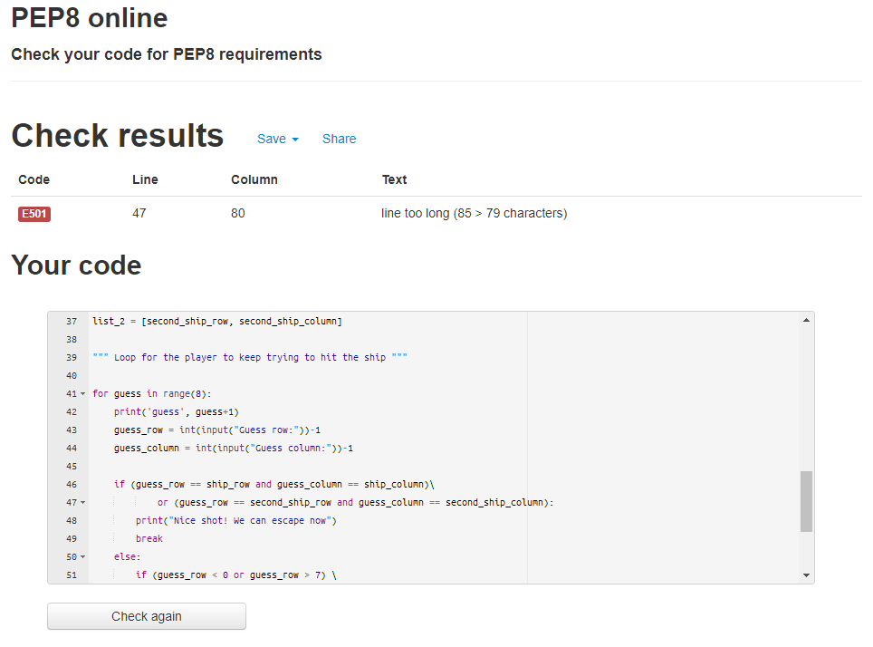

# Project_3_Battleships

With this project you have to guess where the randomly generated enemy ship is located in the sea map, within a certain amount of tries before you loose.

## Features

  - The user can input the column and row they want to aim at.
  - The Game keeps track of the user's turn.
  - When you input a number out of the grid there is a custom message that is displayed.
  - When the user misses the location symbol is changed to display the missing coordinate.
  - The ship location is randomly generated.

## Testing

  - Tested when you hit the enemy ship the game displayed the correct text and stops.
  - Tested that when you miss all your shots the correct text is displayed and the game stops.
  - Tested if the user inputs an out of bounds number the correct text is properly displayed.
  - Tested that the board changes and is updated when you miss a shot.
 
 -Validator Testing
 
  
  - Fully passed the PEP8 online validator with no major issues

## Deployment
  
  -This project was deployed using Code Institute's mock terminal for Heroku.
  
  The steps for deployment are as follows:
    - Created a new Heroku app
    - Set the buildpacks to Python and NodeJS in that order
    - Linked the Heroku app to the repository
    - Clicked on Deploy
    
## Credit
  - This project uses the Code Institute student template for deploying the third portfolio project, the Python command-line project.
